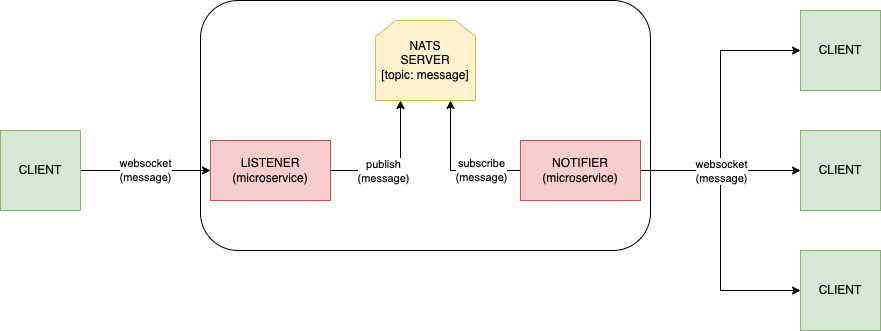
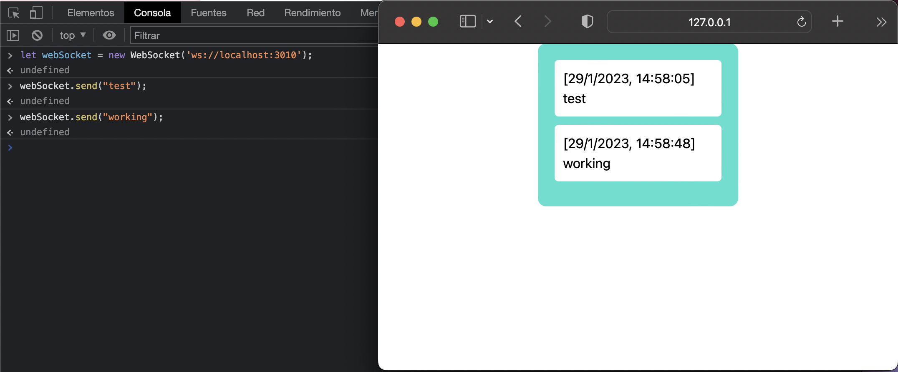

# GiG - Core-tech 

This project involves **2 microservices** located in the same repository for ease of testing. The **communication between** **clients** and the **services** is done using the **WebSocket** **protocol**, and the **communication between** the **2 services** is done using **NATS as a message queue**. 

## Authors

- [@xavimg](https://github.com/xavimg)


## Run Locally

Clone the project

```bash
  git clone https://github.com/xavimg/GiG-websocket-and-messagequeus.git
```
Run this Makefile command:

```bash
  make run
```

## Test Locally

Run this Makefile command:

```bash
  make test
```

## Screenshots



## Demo using wscat

1. Open a terminal and run this command **wscat -c localhost:3010** to connect with service listener throught websocket connection for send messages.
2. Start your client subscriber demo with VSCode extension *live server*
3. Go to your terminal where we previous connect with **wscat -c localhost:3010** and you can start to write messages.
4. Receive all sended messages in client demo subscribers.


# Demo using browser console

1. Open Google Chrome browser and inside console write:
     ```
      let webSocket = new WebSocket('ws://localhost:3010');
      webSocket.send("test");
     ``` 
2. Start your client subscriber demo with VSCode extension *live server*
3. Receive all sended messages in client demo subscribers.


