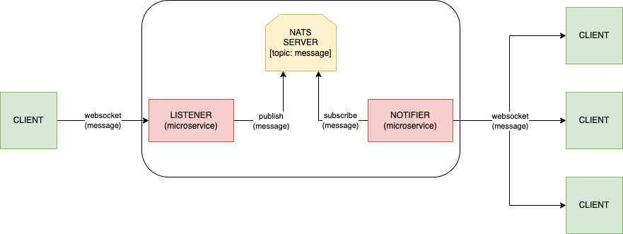

# GiG - Core-tech 

This project involves **2 microservices** located in the same repository for ease of testing. The **communication between** **clients** and the **services** is done using the **WebSocket** **protocol**, and the **communication between** the **2 services** is done using **NATS as a message queue**. This allows for efficient and reliable communication between the different components of the system.

## Authors

- [@xavimg](https://github.com/xavimg)


## Run Locally

Clone the project

```bash
  https://github.com/xavimg/GiG-websocket-and-messagequeus.git
```

Go to **GiG-websocket-and-messagequeus/project**

```bash
  cd project
```
Run this docker-compose command:

```bash
  docker-compose up --build
```


## Diagram



